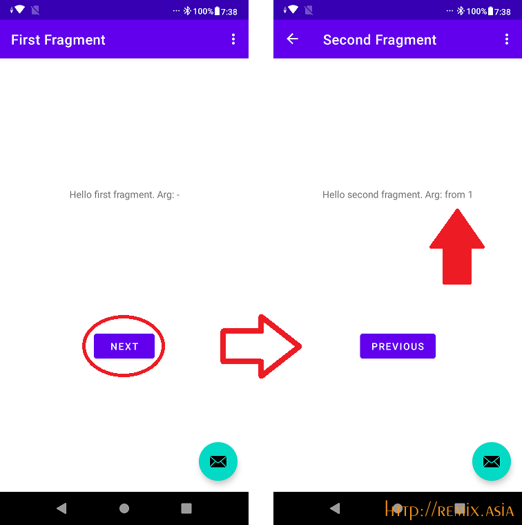
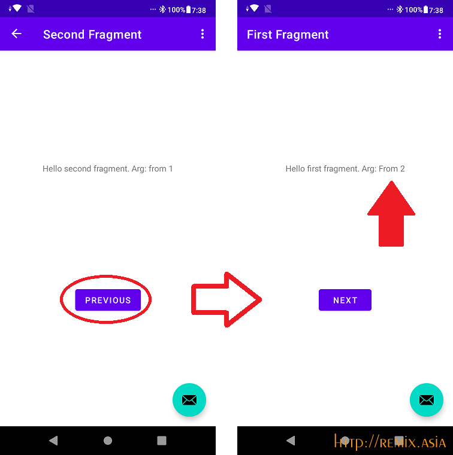
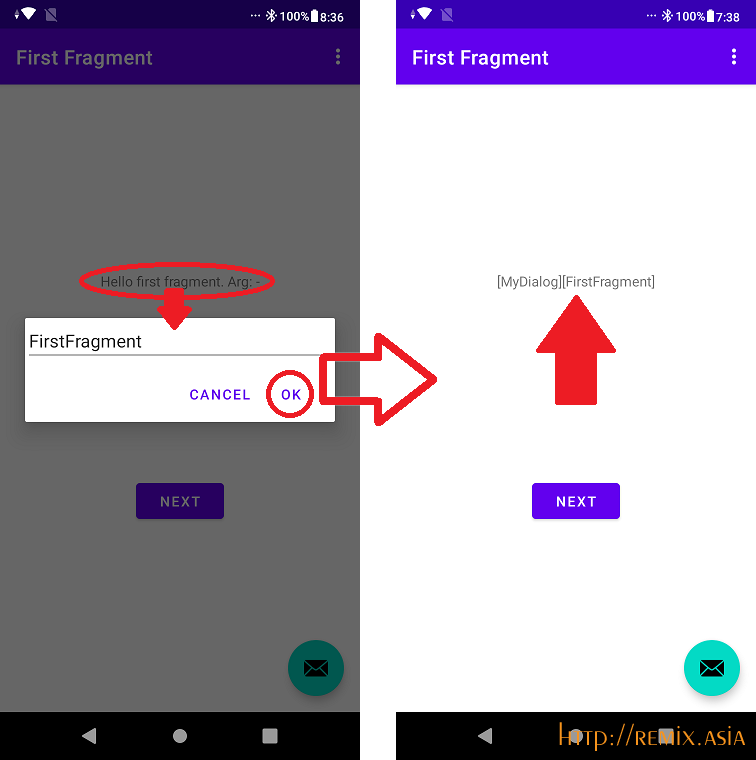
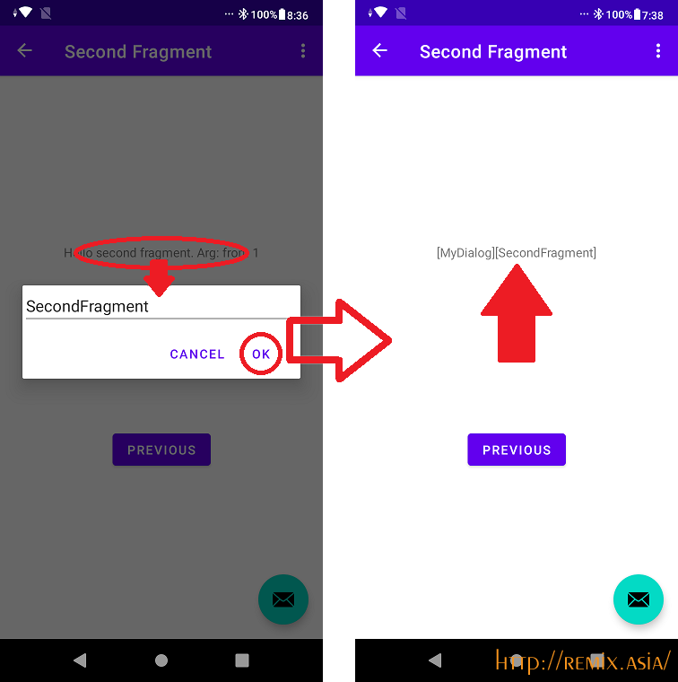
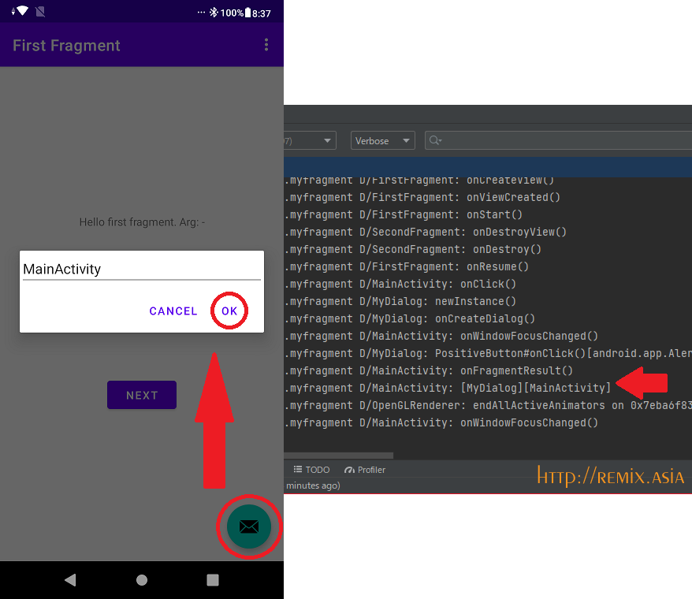

# Study "Basic Activity" Template
## Basic Activity Template (Navigation Fragment)
commit No.75b83b3846e5796639eeabb6fd88cad9d0e5ed13
## step 1. remove binding
commit No.8909f3fc1af6e3500b90eada4ddf59a49972868b
## step 2. life cycle log
commit No.56629759431c7e9156c717f7fc5049a0d88f306d
## step 3. First fragment send messages -> Second fragment receive messages.
commit No.	2dd383fcc98782daa28028cdef1531817c2d8157
<a target="img" href="./img/p010.png"></a>
## step 4. Second fragment send messages -> First fragment receive messages.
commit No.	ee91a7c9e26e14783057b685fdc2cecea5e0f3d3
<a target="img" href="./img/p020.png"></a>
## step 5. Callable DialogFragment both  Activity and Fragment
commit No.	9989d422d7da8149122c1eab43a2ebe78e6d67c9

from first fragment

<a target="img" href="./img/p030.png"></a>

from second fragment

<a target="img" href="./img/p040.png"></a>

from activity

<a target="img" href="./img/p050.png"></a>

# confirmed
Samsung Galaxy S7 edge (Andorid 7.0)

ASUS_X01AD(Android 9)

# Environment
```
Android Studio Dolphin | 2021.3.1
Build #AI-213.7172.25.2113.9014738, built on September 1, 2022
Runtime version: 11.0.13+0-b1751.21-8125866 amd64
VM: OpenJDK 64-Bit Server VM by JetBrains s.r.o.
Windows 11 10.0
GC: G1 Young Generation, G1 Old Generation
Memory: 1280M
Cores: 8
Registry:
    external.system.auto.import.disabled=true
    ide.text.editor.with.preview.show.floating.toolbar=false</pre>
```
# article
https://www.remix.asia/blog/remix/2022/10/basic_activity.html
